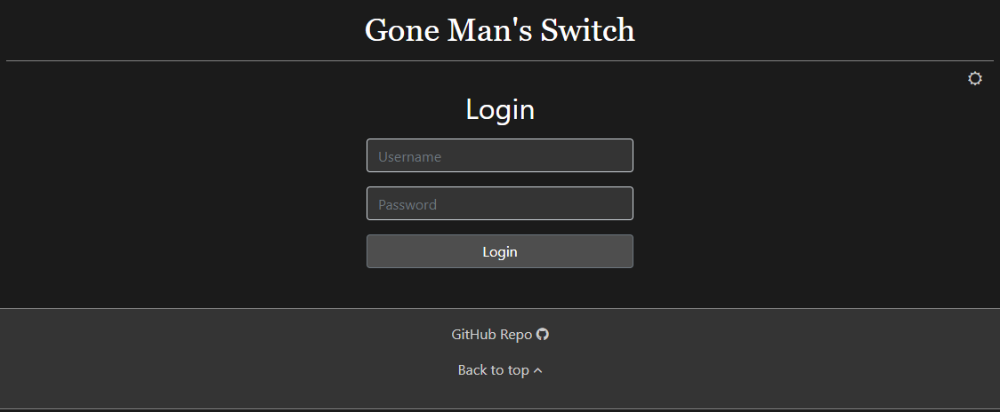
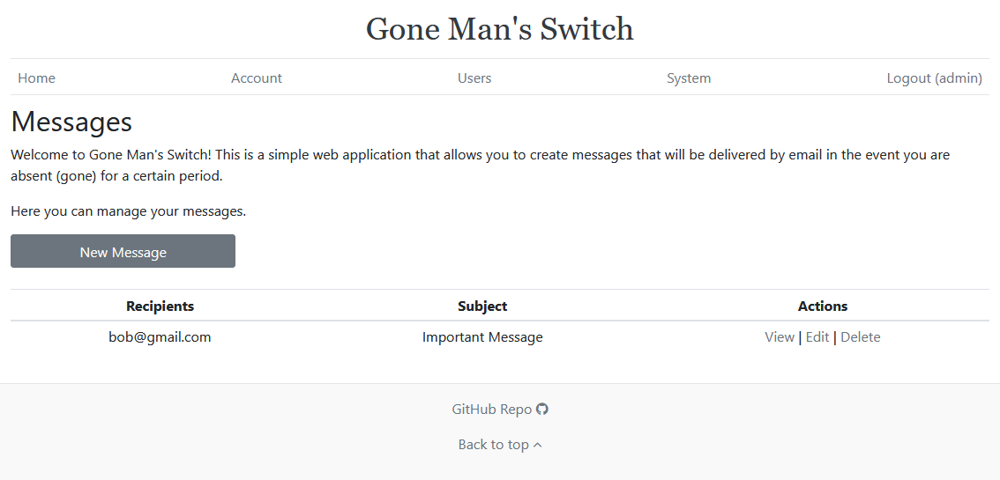
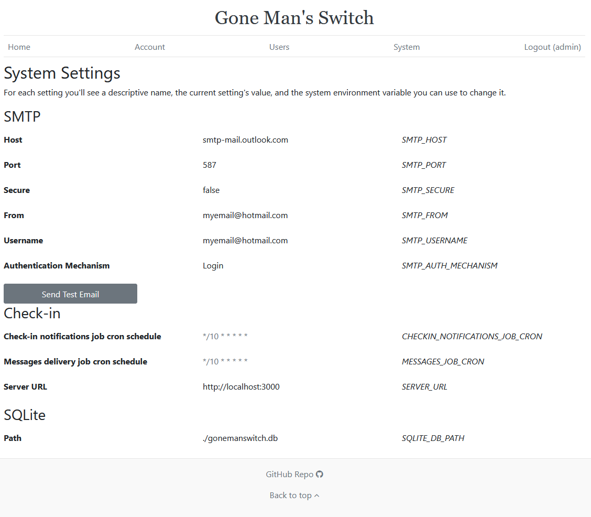

# Gone Man's Switch

Gone Man's Switch is a simple web application that allows you to create **messages** that will be delivered when you are absent (gone) for a certain period.

Topics in this page:
- [Features](#features)
- [Installation Setup](#installation--setup)
- [Local Development](#local-development)
- [Documentation](#documentation)
- [Say Thanks](#say-thanks)
- [FAQ](#faq)
- [Screenshots](#screenshots)

## Features


- Create messages that will be delivered when you are absent (gone) for a certain period
- Receive check-in notifications via Email, SMS or Telegram
- Deliver messages through via Email, SMS or Telegram
- Choose to encrypt the content of your messages
- Test your settings with testing Emails, SMS and Telegram messages
- Manage users

## Installation / Setup

> [!NOTE]
> These instructions require Docker and optionally Docker Compose. However, you can follow a bare-metal installation by simply installing Node.js and following the steps in the [_Local Development_](#local-development) section

To install the latest version of the system using docker you can simply run:
```bash
docker run --name gonemanswitch -v ./:/app/data -p 3000:3000 --restart on-failure jhonderson/gone-man-switch:latest
```

You can also use docker-compose, creating a `docker-compose.yml` file, like [the one in this repo](./docker-compose.yml):
```yaml
version: '3.8'
services:
  gone-man-switch:
    container_name: gonemanswitch
    volumes:
    # The path to the left is the path where you want to store the SQLite database file
      - './:/app/data'
    ports:
      - '3000:3000'
    # environment:
    #  - 'SERVER_URL=https://yourcustomdomain'
    #  - 'COOKIE_SESSION_SECRET=any-secret-random-string-will-do'
    #  - 'MESSAGE_ENCRYPTION_PASSWORD=any-secret-string-will-do'
    # This example uses Microsoft SMTP server configs, you can use any SMTP service
    #  - 'SMTP_HOST=smtp-mail.outlook.com'
    #  - 'SMTP_PORT=587'
    #  - 'SMTP_SECURE=false'
    #  - 'SMTP_FROM=youremail@hotmail.com'
    #  - 'SMTP_USERNAME=youremail@hotmail.com'
    #  - 'SMTP_PASSWORD=your-app-password'
    #  - 'SMTP_AUTH_MECHANISM=Login'
    restart: on-failure
    image: jhonderson/gone-man-switch:latest
```

And running `docker-compose up -d`.

Just like that the system will be up and running in http://localhost:3000, and you can use the username `admin` and password `password` to log in (the default password can be customized).

However, for the system to be fully functional we recommend completing the following settings:
- Configure at least one delivery channel, it could be either SMTP (Email), SMS or Telegram. SMTP can be configured at Account level settings (i.e per user) or at a system level (accessible by all users) through environment variables. SMS and Telegram need to be configured in the Account level settings. See more information about account level settings in [this section](#account-level-settings). These are the environment variables to configure SMTP at a system level:
  - `SMTP_HOST`: Hostname or IP address to connect to
  - `SMTP_PORT`: Port to connect to
  - `SMTP_SECURE`:  if true the connection will use TLS when connecting to server. If `false` (the default) then TLS is used if server supports the STARTTLS extension. In most cases set this value to true if you are connecting to port 465. For port 587 or 25 keep it `false`
  - `SMTP_FROM`:  The email address of the sender. All email addresses can be plain `sender@server.com` or formatted `"Sender Name" sender@server.com`
  - `SMTP_USERNAME`: Username
  - `SMTP_PASSWORD`: Password for the user, or application password
  - `SMTP_AUTH_MECHANISM`: Indicates the authetication type
- Configure the following environment variables:
  - `SERVER_URL`: This the url used by the system to generate external links, such as the link sent for you to check-in, or the link sent to recipients to decrypt a message. Relevant when you exposing this application to the public. It defaults to `http://localhost:3000`
  - `COOKIE_SESSION_SECRET`: Secret used by the [cookie-session](https://www.npmjs.com/package/cookie-session) library to sign the cookie session and prevent tampering. Any secret random string will sufice
  - `MESSAGE_ENCRYPTION_PASSWORD`: Encryption password used to encrypt the content of messages for which encryption was configured as **Encrypt using system encryption password**. Any secret string will sufice

Additional environment variables you can configure:
- `DEFAULT_ADMIN_USER_PASSWORD`: Password of the default user/account created by the system the first time it starts. Default value is `password`
- `COOKIE_SESSION_MAX_AGE_DAYS`: Maximum number of days the session will last. Default value is 2 days
- `SQLITE_DB_PATH`: SQLite database path
- `CHECKIN_NOTIFICATIONS_JOB_CRON`: [Cron schedule expression](https://www.npmjs.com/package/node-schedule#cron-style-scheduling) for the job that sends check-in notifications. It runs daily at 5:00 pm UTC by default (`0 17 * * *`)
- `MESSAGES_JOB_CRON`: [Cron schedule expression](https://www.npmjs.com/package/node-schedule#cron-style-scheduling) for the job that delivers messages. It runs daily at 6:00 pm UTC by default (`0 18 * * *`)

Unless you plan to respond to your check-in notifications from within your local network, we recommend exposing this web application to the public using a reverse proxy and your custom domain provider.

## Local Development

> [!NOTE]
> Make sure you have Node.js >=v18 installed

Download or checkout this repository:
```
git clone https://github.com/jhonderson/gone-man-switch.git
```

Install dependencies:
```
npm install
```

Configure any environment variable you want in the file `.env`, and start the system:
```
node ./bin/www
```

The system will be up and running in http://localhost:3000

## Documentation

### Messages

A message consists of three sections:
- Content: The actual message content you want to send to people
- Destinations: a message has one or more destinations: Email, SMS or Telegram message
- Check-in configuration: Here you specify how often you want the system to check on you by sending you check-in notifications, and the maximum amount of time the system will wait for you to respond back before delivering the message

#### Destination: Email, SMS or Telegram

Check-in notifications and Messages can be delivered via Email, SMS or Telegram:
- Email: You can specify a comma-separated list of destination emails (recipients), the subject of the email, and an optional attachment file (maximum size supported is 20MB)
- SMS: You can specify a SMS service provider (currently only Twilio is supported) and a comma-separated list of destination phone numbers
- Telegram: You can specify a comma-separated list of chat-ids where the messages will be delivered. See how to get the chat ids in the [_Telegram_](#telegram) section

See how to configure the system to support Emails (SMTP), SMS or Telegram in the section [_Account Level Settings_](#account-level-settings).

#### Check-in Configuration

Check-in configuration section has two entries:
- _Send me a check-in notification if I am absent for more than_: Period of inactivity after which the check-in notification will be sent
- _Deliver this message if I don't respond to my check-in notification after_: If the check-in notification is not responded by this time, the message will be delivered

Simple right?

#### Message Content Encryption

By default, the message content is stored as plain text in the system's database. However, you can choose to encrypt it, these are the available encryption options:

| Option                                   | Description                                                                                                                                                                                                                                                                                                                                                                                                                                                                                   | Recipients receive                                                                                                                                                                                                         | Message content is stored internally as | Can the system decrypt the message content by itself? |
|------------------------------------------|-----------------------------------------------------------------------------------------------------------------------------------------------------------------------------------------------------------------------------------------------------------------------------------------------------------------------------------------------------------------------------------------------------------------------------------------------------------------------------------------------|----------------------------------------------------------------------------------------------------------------------------------------------------------------------------------------------------------------------------|-----------------------------------------|-------------------------------------------------------|
| Unencrypted                              |  The message content is stored as plain text in the system database.  Use this option if you are not sending sensitive information such  as passwords, or if you are confident that nobody will have access  to the system's database.                                                                                                                                                                                                                                                        | The same message you type in the content field                                                                                                                                                                             | Plain text in the database              | Yes                                                   |
| Encrypt using system encryption password |  The message content is stored in encrypted format in the system database.  The encryption password comes from the system environment variable MESSAGE_ENCRYPTION_PASSWORD. This adds a layer of protection in  the sense that to be able to read the message content the intruder  would not only need to have access to the system's database, but also to  the system environment variables, and know the system's  encryption logic.                                                      | The same message you type in the content field                                                                                                                                                                             | Encrypted format in the database        | Yes                                                   |
| Encrypt using custom encryption password |  The message content is stored in encrypted format in the system database.  The encryption password comes from the user when creating/updating the message. Because  this encryption password is not stored anywhere, the recipients will have to  enter this encryption password when reading the message.  This is the most secure option, but if they don't manage to guess your  encryption password with the hint you gave them, they won't be able to see the content  of your message. | A standard message containing a link to decrypt the message and the encryption password hint. Once the recipient opens the link, the system will ask for the encryption password and then show the message content content | Encrypted format in the database        | No                                                    |

### Account Module

Using the account module you can:
- Update your account information (such as username), or change your password
- Update your check-in destinations. These are the delivery channels the system will use to send you check-in notifications
- Update your account level settings: Configuration for SMTP, SMS and Telegram
- Test your settings by sending test Emails, SMS and telegram messages

#### Check-in Destinations

This is where you specify where should the system send you check-in notifications:
- Email: Specify a comma-separated list of destination emails (recipients)
- SMS: Specify a SMS service provider and a comma-separated list of destination phone numbers
- Telegram: Specify a comma-separated list of Telegram chat-ids where the messages will be delivered. See how to get the chat ids in the [_Telegram_](#telegram) section

#### Account Level Settings

This is where you specify the configuration parameters needed by the system to send Emails, SMS or Telegram messages. You don't have to configure all channels, but you should configure at least one so that your check-in notifications and messages can be delivered. Because these settings are per user, each user will have to setup it's own information.

##### SMTP

Store the SMTP configuration entries in _Account > Account Level Settings > SMTP_:
- host: Hostname or IP address to connect to
- port: Port to connect to
- secure:  if true the connection will use TLS when connecting to server. If `false` (the default) then TLS is used if server supports the STARTTLS extension. In most cases set this value to true if you are connecting to port 465. For port 587 or 25 keep it `false` (i.e unchecked)
- from:  The email address of the sender. All email addresses can be plain `sender@server.com` or formatted `"Sender Name" sender@server.com`
- username: Username
- password: Password for the user, or application password
- auth mechanism: Indicates the authetication type

You can read more about SMTP configuration options [here](https://nodemailer.com/smtp/). You can validate your SMTP settings by using the feature [_Test Your Settings_](#test-your-settings).

##### Twilio

Configuration parameters needed to send SMS messages through Twilio:
- Account SID: Account string unique identifier
- Auth Token: Account authorization token
- From Number: Phone number you bought from Twilio. It will be used as the source number of the SMS messages the system sends

Follow [this Twilio tutorial](https://www.twilio.com/docs/messaging/quickstart/node) to see how to obtain those three values from your Twilio console.

Once you get those values, store them in _Account > Account Level Settings > Twilio_

##### Telegram

The first step is creating a Telegram Bot so that the system can send messages through it:
1. Follow the [How Do I Create a Bot guide](https://core.telegram.org/bots#how-do-i-create-a-bot) to create a Telegram Bot
2. Get your bot token with [Obtain Your Bot Token guide](https://core.telegram.org/bots/tutorial#obtain-your-bot-token)

Your Bot token should look like this:
```bash
9581632541:AAFD81qewr3ouhsdg0983n3aasdf2l3k4a
```

Store your token in the **Bot Token** (_Account > Account Level Settings > Telegram_) field

To retrieve the chat id of a particular conversation you need to:
- Share the Bot with the Telegram user you want to send messages to. It can be you or someone else
- Make this person send a message to your Bot, it can be anything
- Replace the place holder with your Bot token here `https://api.telegram.org/bot<REPLACE_THIS_WITH_YOUR_BOT_TOKEN>/getUpdates`. Paste the resultant URL in your browser and open it
- The chat id will be in the field `result[0].message.chat.id``

For instance, if the result were this:
```json
{
  "result": [
    {
      "message": {
        "from": {
          "id": 222222222,
          // ...
        },
        "chat": {
          "id": 123456789,
          // ...
        },
          // ...
      }
    }
  ]
}
```
Your chat-id would be `123456789`.

#### Test Your Settings

You can check if your settings (SMTP, SMS and Telegram) are valid by going to _Account > Account Level Settings > Test Your Settings_. You can send test Emails, SMS and Telegram messages. The system will let you know of any error while sending these messages.

### System Module

Using the system module you can see the current system settings configured through environment variables.

### Users Module

Using the users module you create, edit and delete users. New users can login and user the system too. There are 2 type of users:
- `ADMIN`: They can create and manage messages, update their account, and access the modules Users and System, meaning they can manage users, see the system information, and send test emails.
- `USER`: They can create and manage messages, and update their account.

## Say Thanks

Do you find the project useful? consider giving it a ⭐, contributing to the project or buying me a coffee.

<a href="https://www.buymeacoffee.com/jhonderson" target="_blank"></a>

## FAQ

### Can you show me an example of how it works?

Let's say you create a message with the following information:
- Content: `Hello, here is some important information I want you to have...`
- Destinations:
  - Email:
    - Recipients: `bob@hotmail.com, lily@gmail.com`
    - Subject: `Important message for you`
- Check-in Configuration:
  - Send me a check-in notification if I am absent for more than: `6 Months`
  - Deliver this message if I don't respond to my check-in notification after: `10 Days`

After 6 months of absence (you don't login to Gone Man's Switch) you will receive a check-in notification like this:
```
  Hello,

  Could you please confirm you are still available using the following link?: http://localhost:3000/checkin/loooooongcode

  Thanks!
```

Then 2 things may happen:
1. If you confirm the notification by clicking the link within 10 days of receiving it, the message won't be delivered and you will get another notification 6 months later.
1. If you do not confirm the notification within 10 days of receiving it, the message will be delivered to the recipients via email (to `bob@hotmail.com, lily@gmail.com`) and deleted from the system. 

### My check-in notifications/messages are not being delievered

1. Make sure your delivery destination settings are valid by sending a testing email, sms or telegram message in _Account > Account Level Settings > Test Your Settings_.
2. Check the system logs by running `docker logs gonemanswitch`. All important messages, including errors, will be in the logs. For instance, the message `Message with id xxx could not be delivered` means that there was a problem delivering your message, and you will also see more details about the problem: `Error delivering message by SMS: <more details>`.
3. Keep in mind that every time you interact with the website (I.e you open the website while logged in), the system will interprete that as you being available and will mark your checkin notifications as acknowledged. So for a message to be delivered you need to stop interacting with the website for as long as the time period you configure in the message section *Send me a check-in notification if I am absent for more than...*, plus the time period at *Deliver this message if I don't respond to my check-in notification after...*
4. There could be 1 day of delay in receiving your check-in notification: Let's say you create a message on December 9th, specifying that you want to receive check-in notifications if you are absent for more than **1 day**. Let's also say that you logout the same day at 5:01 pm UTC and you stop interacting with the system. By default the check-in notifications job will run on December 10th at 5:00 pm UTC, but since it hasn't been a day since your last interaction, but 23 hours and 59 minutes only, the check-in notification won't be delivered on December 10th as you would expect, and it will be delivered on December 11th 5:00 pm instead.

### What happens to the message information once it is delivered?

Once delivered, the message information is deleted from the system.

### Is the message content store as plain text?

By default yes, but you can choose to encrypt it using either the server encryption password or a custom encryption password provided by you. See more in the [_Message Content Encryption_](#message-content-encryption) section.

### Can I configure encryption for attachments?

The system doesn't support encrypting attachments at the moment. But you are welcome to encrypt the attachment before uploading it and providing information to the recipients on how to decrypt it.

### How do I know if my SMTP configurations are valid?

You can send a test email from the web UI. See more in the [_Test Your Settings_](#test-your-settings) section.

### Can I invite other users to use my system instance?

Yes, as an administrator you can create other users. Those users can log in and configure their messages. See more in the [_Users Module_](#users-module) section.

## Screenshots

Login:



Home:



System:

